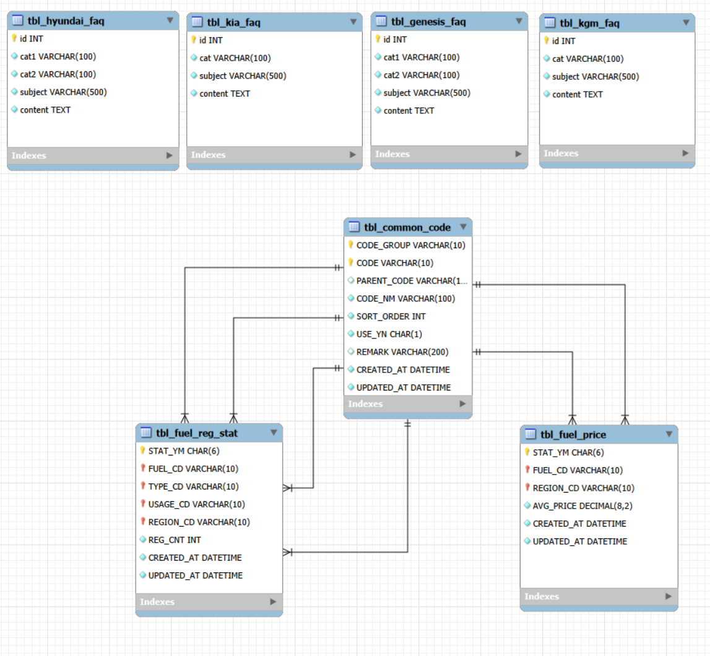

# 에너지 가격 변동이 모빌리티 시장에 미치는 영향 분석
> **전국 5개년 유가 흐름에 따른 하이브리드·전기차 등 5가지 연료 타입별 차량 등록 패턴 도출**

## 팀 소개
|  |  |  | 
| :---: | :---: | :---: |
|한경찬|임준|우석현|

**개발 기간:** 2026.03.30 - 2026.03.31 (총 2일)

## 프로젝트 개요

### 1. 주제
**국산차 월별 등록 데이터와 유가 변동의 상관관계 분석 및 시각화**
 - 유가 변동이 브랜드별/유종별 자동차 판매량에 미치는 영향을 시각적으로 분석하여 시장 동향 파악

### 2. 선정 배경

 - **최근 유가 시장의 큰 변동성:** 유가 급등락 반복에 따른 소비자 선택의 변화 및 유가의 경제 영향력 분석의 필요성
 - **통념과 데이터의 차이:** '유가가 오르면 특정 차종 판매량이 감소한다'는 통념을 데이터 기반으로 검증
 - **파편화된 정보:** 자동차 등록 통계와 유가 정보가 각기 다른 기관에 산재해 있어 통합적인 분석의 어려움


### 3. 프로젝트 목표

 - **데이터 수집 및 통합:** 국산차 월별 등록 데이터와 전국 유가 데이터를 크롤링하여 분석용 DB로 통합
 - **상관관계 분석:** 시계열 데이터(등록 대수, 유가) 간의 추세 변화를 비교 분석하여 인사이트 도출
 - **시각화 대시보드 구현:** 사용자가 직접 차종을 선택해 등록 대수와 유가 추이를 한눈에 비교할 수 있는 **Streamlit** 기반 대시보드 서비스 구현

- ---

## 기술 스택 (Tech Stack)
 - **Language:** `Python 3.10+`
 - **Database:** `MySQL`
 - **Web Framework:** `Streamlit`
 - **Visualization:** `Plotly`

## 사용한 데이터
 국도교통 통계누리 - 자동차등록현황보고 (Total Registered Motor Vehicles)
 <br>https://stat.molit.go.kr/portal/cate/statMetaView.do?hRsId=58

 한국석유공사(오피넷) - 년도별 주유소 평균판매유가
 <br>https://www.opinet.co.kr/user/dopospdrg/dopOsPdrgSelect.do


## 파일구조

```text
SKN29-1st-6Team/
├── app/
│   ├── dashboard.py         # 데이터 시각화 대시보드 페이지
│   ├── db_connect.py        # 데이터베이스 연결 및 세션 관리
│   ├── introduce.py         # 프로젝트 소개 및 팀원 안내 페이지
│   ├── question.py          # 사용자 질문/답변(Q&A) 페이지
│   └── utils.py             # 공통 유틸리티 함수 모듈
├── data/
│   ├── crawling_genesis.py  # 제네시스 데이터 크롤링 스크립트
│   ├── crawling_hyundai.py  # 현대 데이터 크롤링 스크립트
│   ├── crawling_kgm.py      # KGM 데이터 크롤링 스크립트
│   ├── crawling_kia.py      # 기아 데이터 크롤링 스크립트
│   ├── data_upload.py       # 수집 데이터를 DB에 업로드하는 스크립트
│   ├── price_upload.py      # 유가 정보를 DB에 업로드하는 스크립트
│   └── xlsx/                # 월별 자동차 등록 통계 및 유가 데이터 (Raw Data)
├── image/
│   └── main.png             # 메인 화면 내 사용 이미지
├── output/
│   ├── 테이블명세서_데이터베이스설계문서.xlsx  # DB 테이블 명세서
│   └── ERD_수집데이터.png      # 데이터베이스 ERD 다이어그램
├── sql/
│   ├── faq_data.sql         # FAQ 초기 데이터 SQL
│   ├── faq_table.sql        # FAQ 테이블 생성 SQL
│   ├── tbl_fuel_price.sql   # 유가 테이블 생성 SQL
│   ├── tbl_fuel_reg_stat.sql # 자동차 등록 통계 테이블 생성 SQL
│   └── vehicle_stats.sql    # 차량 통계 테이블 생성 SQL
├── .gitignore               # Git에서 추적하지 않을 파일/폴더 목록
├── README.md                # 프로젝트 관련 상세 설명 문서
└── main.py                  # Streamlit 메인 실행 파일
```

## 데이터베이스 구조

 

- ---
## 프로젝트 결과


### 01) 신차 등록의 리드 타임 확인
> 유가 변동이 실제 시장의 등록 데이터로 반영되기까지 **평균 3개월의 물리적 시차**가 존재함을 확인

* **상관관계 정점:** 연료별(경유) 및 차종별(승합/화물) 데이터에서 유가 변동 발생 **3개월 후** 양의 상관관계 최대치 기록.
* **시사점:** 차량 구매 의사 결정부터 실제 출고 및 행정상 등록이 완료되기까지의 행정적·물리적 소요 시간 확인.

---

### 02) 타겟 시장별 유가 반응 민감도 비교
시장의 목적(상업용 vs 개인용)에 따라 유가 변동에 대한 반응 민감도가 다르게 나타남.

| 구분 | **민감군 (상용/물류 목적)** | **둔감군 (일반/승용 목적)** |
| :--- | :--- | :--- |
| **대상 차종** | 화물, 승합, 경유, 사업용 차량 | 비사업용, 승용차 |
| **데이터 특성** | 유가 변동과 **뚜렷한 상관성** 보유 | 유가 변동폭과 관계없는 **일정한 흐름** |
| **임계 지점** | 고유가 장기화(5~6개월) 시 등록 급감 | 유가보다 **소득, 금리** 등 타 변수에 민감 |

---

### 03) 친환경 차량의 유가 독립성 확인
**"유가가 오르면 친환경차 수요가 늘어날 것"** 이라는 통념과 실제 데이터 사이의 차이 확인.

* 전기차 및 하이브리드 차량은 유가 변동과 유의미한 양의 상관관계가 나타나지 않음.
* 연료비 절감이라는 경제적 이점보다 **정부 보조금 규모, 충전 인프라 보급률, 신차 출시 라인업** 등 정책적·환경적 외부 요인이 영향을 미친다 예상.